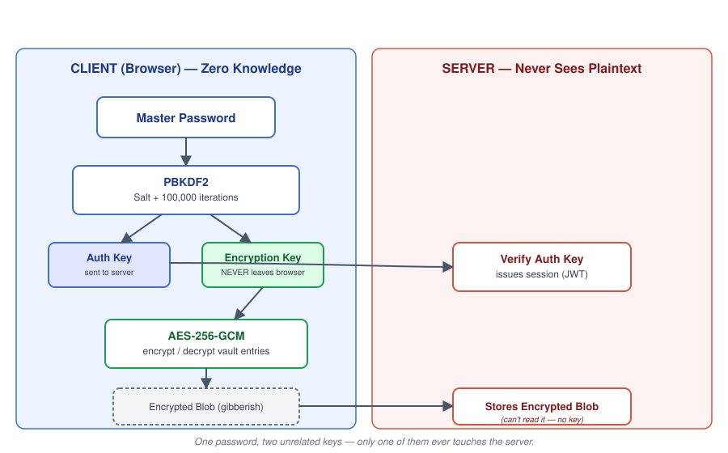

# Vaultify 🔐

A **Zero-Knowledge Password Manager**. Vaultify is built so that even the
server storing your data can never read it — all encryption and decryption
happens entirely in your browser, using your Master Password. The server
only ever sees encrypted gibberish.

> If the server is hacked, the attacker finds nothing but unreadable noise.

## How It Works

Your Master Password is stretched into **two separate, unrelated keys**
using PBKDF2 — a slow, salted key derivation function that resists
brute-force attacks.

- **Auth Key** → sent to the server, used only to verify login
- **Encryption Key** → never leaves your browser, used to lock/unlock your vault

Because these two keys are mathematically unrelated outputs of the same
one-way function, stealing one (e.g. from a hacked database) gives an
attacker zero ability to derive the other.

## Crypto Library (`crypto.js`)

The core cryptography lives in [`crypto.js`](./crypto.js):

| Function | Purpose |
|---|---|
| `generateSalt()` | Creates a random 16-byte salt (unique per user, stored openly) |
| `deriveKeyFromPassword(password, salt)` | Turns the Master Password into a 256-bit AES key via PBKDF2 (100,000 iterations) |
| `encryptData(key, data)` | Encrypts a vault entry with AES-256-GCM, returns IV + ciphertext |
| `decryptData(key, iv, ciphertext)` | Decrypts a vault entry back to the original object |

## Tech Stack

- **Frontend:** React.js
- **Backend:** Node.js
- **Cryptography:** Web Crypto API — PBKDF2, AES-256-GCM, SHA-256
- **Database:** PostgreSQL / MongoDB *(TBD)*

## Project Status

- [x] **Week 1 — Crypto Logic:** PBKDF2 key derivation + AES-256-GCM encrypt/decrypt (`crypto.js`)
- [ ] **Week 2 — Backend & Sync:** Node.js API, Auth Key login flow, save/load vault endpoints
- [ ] **Week 3 — The Manager UI:** Dashboard, Add Password form, Password Generator
- [ ] **Week 4 — 2FA & Polish:** TOTP 2FA, copy-to-clipboard, security audit

## What if I forget my Master Password?

Your data is lost forever — and that's by design, not a flaw. Since the
server never has your password or your Encryption Key, there is no
"reset password" flow that could restore your vault. Any such flow would
mean the server is capable of unlocking your data — which would break the
zero-knowledge guarantee entirely. *(Full threat model doc coming soon.)*
